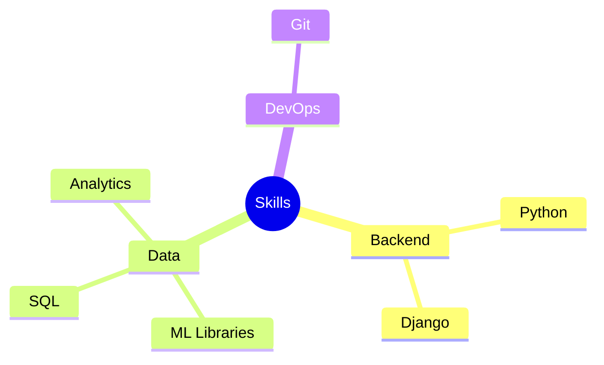

  <!-- Animated Header -->
  
  
  # ⚡ Anel ⚡
  *Django Developer & ML Enthusiast*

  <!-- Animated Typing -->
  

<!-- Skills Section -->

  <h2>💫 Technologies & Tools</h2>
  
   
  

<!-- Tech Stack Mindmap -->
## 💻 Tech Universe

<!-- GitHub Stats -->
## 📊 GitHub Stats

  
   
  
   
  

<!-- Core Strengths -->
## 🎯 Core Strengths
<table align="center">
  <tr>
    <td align="center">
      
       
      <strong>Problem Solving</strong>
    </td>
    <td align="center">
      
       
      <strong>Quick Learning</strong>
    </td>
    <td align="center">
      
       
      <strong>Clean Code</strong>
    </td>
  </tr>
</table>

<!-- Activity Graph -->
## 📈 Contribution Graph

<!-- Trophy -->

  <h2>🏆 GitHub Profile Trophy</h2>
  

<!-- Connect Section -->
## 🔗 Connect With Me

  

<!-- Profile Views -->

  

<!-- Footer -->

