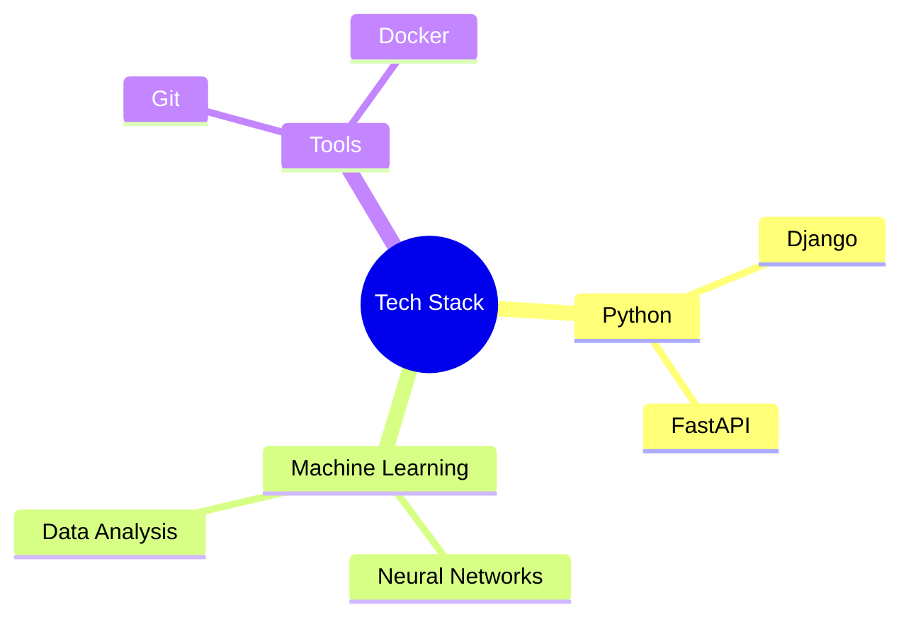

# ⚡ Anel ⚡
*Django Developer & ML Enthusiast*

<!-- Dynamic typing effect -->

## 💫 Tech Cosmos

## 🚀 Projects Galaxy

## 📊 Stats Constellation

<!-- Replace with your GitHub username -->

## 🎯 Core Strengths

<table>
  <tr>
    <td align="center">
      
       
      <strong>Problem Solving</strong>
    </td>
    <td align="center">
      
       
      <strong>Quick Learning</strong>
    </td>
    <td align="center">
      
       
      <strong>Clean Code</strong>
    </td>
  </tr>
</table>

## 🔗 Connect

  

<!-- Activity Graph -->

<!-- Profile Views Counter -->

---

  
*🌟 Currently crafting digital solutions and exploring new technologies 🌟*

